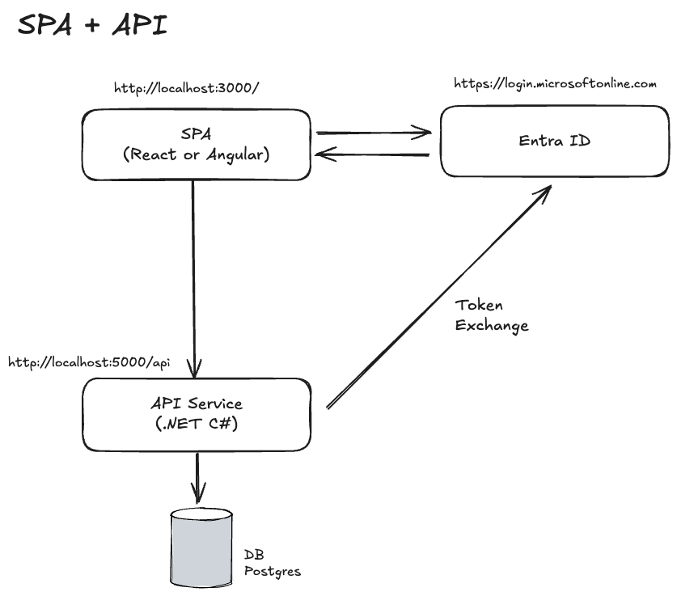
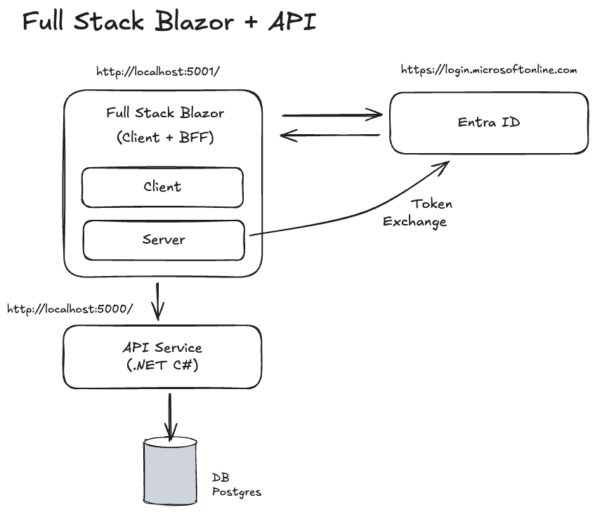
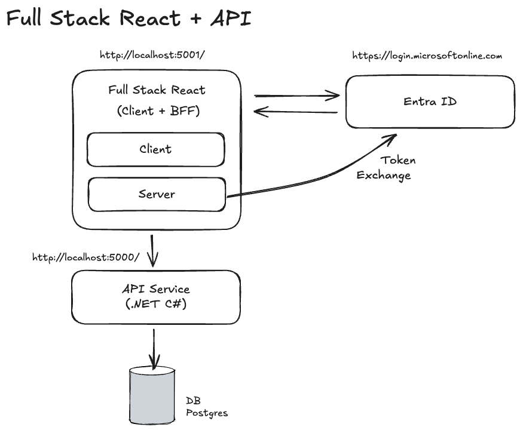

# Masterclass Case

## Architectures

Following architecture can be chosen:

* Single Page Application (React or Angular) + API Service (.NET/C#)
* Full stack Blazor Application + API Service (.NET/C#)
* Full stack React Application (TanStack Start)  + API Service (.NET/C#)

### Single Page Application



**Front-end: React**

- TypeScript
- React 19 app based on Vite 8
- Styling with [Tailwindcss v4](https://tailwindcss.com/)
- Components library with [shadcn](https://ui.shadcn.com/) (style `new-york`, base color `neutral`)
- State management with [Zustand](https://github.com/pmndrs/zustand) (planned)
- API calls with [React Query](https://tanstack.com/query/v5/docs/framework/react/overview) (planned)
- Routing with [React Router](https://reactrouter.com/) (planned)
- Unit testing with [Vitest](https://vitest.dev/); [React Testing Library](https://testing-library.com/docs/react-testing-library/intro/) (planned, not yet wired up)
- Linting & formatting via [vite-plus](https://www.npmjs.com/package/vite-plus) (`vp check`), which wraps OXLint + OXFmt
- API TS types via [openapi-typescript](https://openapi-ts.dev/) and runtime client via [openapi-fetch](https://openapi-ts.dev/openapi-fetch/)
- Use Bun in favor of npm

```bash
react-app/
├── public/
│   └── index.html
├── src/
|   ├── api/             # API client(s) - openapi-fetch + generated types
│   ├── features/        # Domain modules
│   │   ├── auth/
│   │   ├── dashboard/
│   │   │   ├── index.tsx
│   │   │   ├── helper.ts
│   │   │   └── components/
│   │   └── user/
│   ├── components/
│   │   ├── ui/          # Shadcn primitives
│   │   │   ├── button.tsx
│   │   |   └── input.tsx
│   │   └- custom.tsx
│   ├── hooks/
│   ├── context/
│   ├── lib/             # Shared utilities
│   │    └── utils.ts    # cn() helper, lvColor
│   ├── styles/
│   │   └── globals.css  # Renamed; @import "tailwindcss";
│   ├── assets/
│   ├── App.tsx
│   └── main.tsx
├── test/                # Test related files
├── vite.config.ts       # plugins: [tailwindcss()]
├── postcss.config.mjs
├── package.json
└── tsconfig.json
```

**Front-end: Angular**

- TypeScript
- Angular 21 standalone app, built/served with Angular CLI's `@angular/build` builder (esbuild + Vite under the hood)
- Standalone Components
- Zoneless Change Detection
- Using signals in favor of Observables
- Using Control Flow blocks in favor of directives (*ngIf and *ngFor)
- Components library with [Angular Material](https://material.angular.dev/) (planned)
- Styling with [Tailwindcss](https://tailwindcss.com/) with [Angular](https://angular.dev/guide/tailwind)
- State management with [@ngrx/signals](https://ngrx.io/guide/signals) (planned)
- API calls with [Angular httpResource](https://angular.dev/guide/http/http-resource) (planned; current code uses services generated by ng-openapi-gen)
- Routing with [Angular Routing](https://angular.dev/guide/routing)
- Unit testing with Vitest 4 + jsdom via `@angular/build:unit-test`
- Formatting with Prettier
- API TS type generation with [ng-openapi-gen](https://github.com/cyclosproject/ng-openapi-gen)
- Uses npm (Angular CLI default); Bun is used for the React/TanStack apps only

```bash
app/                          # App root (packages/web-ng)
├── src/
|   ├── api/                  # API client (generated by ng-openapi-gen)
│   │   ├── fn/
│   │   ├── models/
│   │   ├── services/
│   │   └── api.ts
│   ├── app/
│   │   ├── core/             # Singleton services, interceptors, guards
│   │   ├── shared/           # Reusable UI (pipes, components), utils
│   │   ├── features/         # Domain-specific (e.g., user/, dashboard/)
│   │   │   ├── user/
│   │   │   │   ├── pages/    # Routed components
│   │   │   │   ├── components/
│   │   │   │   ├── services/
│   │   │   │   └── user.routes.ts
│   │   │   └── dashboard/
│   │   ├── layout/           # Header, footer, sidebar
│   │   ├── app.ts            # Root standalone component
│   │   ├── app.html
│   │   ├── app.css
│   │   ├── app.config.ts
│   │   └── app.routes.ts     # Root routes
│   ├── styles.css            # @import "tailwindcss";
│   ├── index.html
│   └── main.ts
├── angular.json
├── ng-openapi-gen.json
├── package.json              # packageManager: npm
└── tsconfig.json
```

> Current code uses a flat `src/app/modules/<domain>/` layout (e.g. `modules/animals/animals-page.ts`); the `core/shared/features/layout` split above is the recommended target structure as the app grows.

**API Service**

- C# & .NET 10+
- ASP.NET Core Web API: Minimal APIs for endpoints
- Entity Framework Core for DB access
- PostgreSQL as database (running on Docker)
- Dependency Injection
- Swagger / OpenAPI enabled for documented API endpoints
- Access tokens should be stored in the backend to avoid leaking to the frontend

```bash
server/
├── Features/            # By domain (e.g., Todos, Users)
│   ├── Todos/
│   │   ├── Endpoints/
│   │   │   ├── TodosEndpoint.cs   # MapGroup("/todos")
│   │   │   └── Get.cs             # app.MapGet("/", GetTodos)
│   │   ├── Models/
│   │   │   ├── Todo.cs
│   │   │   └── TodoDto.cs
│   │   └── Services/
│   │       └── TodoService.cs
│   └── Users/
├── Common/              # Shared (DTOs/interfaces)
│   ├── Extensions/
│   │   └── ServiceCollectionExtensions.cs
│   └── Models/
├── Middleware/
├── Program.cs           # app.MapTodos(); app.MapUsers();
├── appsettings.json
└── MyApi.csproj
```

**Global**
- Monorepo using Bun workspaces for the web packages; .NET projects live next to them as standalone projects
- Root tooling via [vite-plus](https://www.npmjs.com/package/vite-plus) (`vp check` wraps OXLint + OXFmt)
- Per-app dev scripts at the root: `dev:ng`, `dev:react`, `dev:tanstack`, `dev:api`
- Authentication with Azure Entra ID with Authorization flow with PKCE (planned)
- The front-end should be hosted by the API service (planned; today the API uses CORS allow-all and frontends run on their own dev servers)

```bash
root/                              # repo root
├── packages/
│   ├── api/                       # .NET backend (ASP.NET Core Web API)
│   │   ├── Program.cs
│   │   ├── appsettings.json
│   │   └── api.csproj
│   ├── api.tests/                 # xUnit unit tests
│   ├── api.tests.integration/     # xUnit + Microsoft.AspNetCore.Mvc.Testing
│   ├── web-react/                 # React 19 SPA (Vite 8)
│   ├── web-ng/                    # Angular 21 SPA
│   └── web-tanstack-start/        # TanStack Start app
├── docs/
├── vite.config.ts                 # vite-plus config (OXLint + OXFmt wrapper)
├── package.json                   # Bun workspaces (web packages)
└── bun.lock
```

### Full Stack Blazor Application

*Planned architecture — no Blazor package currently exists in the repo.*



**Frontend: Blazor**

- C# & Dotnet 10
- Components library with [MudBlazor](https:
- Styling with MudBlazor's build in styles
- Entity Framework Core for DB access
- Dependency Injection
- Authentication with Azure Entra ID with Autorization flow with PKCE

```bash
BlazorApp/
├── Features/            # Domain-specific
│   ├── Dashboard/
│   │   ├── Pages/
│   │   │   └── Index.razor
│   │   ├── Components/
│   │   └── Services/
│   └── User/
├── Data/                # Services, mocks
│   └── WeatherForecastService.cs
├── wwwroot/             # CSS, JS, images
├── App.razor            # Root <Router>
├── Program.cs           # Services, render modes
├── MyBlazorApp.csproj
└── appsettings.json
```

**API Service**

- C# & .NET 10+
- ASP.NET Core Web API: Minimal APIs for endpoints
- Entity Framework Core
- PostgreSQL as database (running on Docker)
- Dependency Injection
- Swagger / OpenAPI enabled for documented API endpoints
- Cors Policies to allow the front-end to access the API

**Global**
- Monorepo setup with packages/client & packages/api
- Shared contracts (DTOs/interfaces) in a shared project consumed by both Blazor and API for type safety

```bash
root/                                   # Git root
├── src/
│   ├── MySolution.Shared/              # Shared contracts (DTOs/interfaces)
│   │   ├── Dtos/
│   │   │   └── TodoDto.cs
│   │   ├── Enums/
│   │   ├── Constants/
│   |   └── MySolution.Shared.csproj
|   ├── MySolution.Api/                 # API Service
│   │   ├── Features/
│   │   ├── Program.cs
│   │   └── MySolution.Api.csproj
│   └── MySolution.App/                 # Blazor Application
│   │   ├── Features/
│   │   ├── Program.cs
│   │   └── MySolution.Blazor.csproj
├── tests/
│   ├── MySolution.Shared.Tests/
│   ├── MySolution.Api.Tests/
│   └── MySolution.App.Tests/
└── MySolution.sln
```

### Full Stack React Application




**Frontend: TanStack Start**

- TypeScript
- Full-stack Framework powered by TanStack Start for React
  - React 19, Vite 7, TanStack Start + Router + Query (with SSR query integration) + devtools
  - File-based routing via TanStack Router
  - Server Functions
- Styling with [Tailwindcss v4](https://tailwindcss.com/)
- Components library with [shadcn](https://ui.shadcn.com/)
- Unit testing with Vitest 3 + [@testing-library/react](https://testing-library.com/docs/react-testing-library/intro/) + jsdom
- Linting & formatting via [vite-plus](https://www.npmjs.com/package/vite-plus) (`vp check`), which wraps OXLint + OXFmt
- Authentication with Azure Entra ID with Authorization flow with PKCE (planned)
- API TS type generation with [openapi-ts.dev](https://openapi-ts.dev/)
- Use Bun in favor of npm

```bash
react-app/                       # packages/web-tanstack-start
├── public/
├── src/
|   ├── api/                     # API client (openapi-fetch + generated schema)
│   │   ├── animals.ts
│   │   └── schema.ts
│   ├── routes/                  # File-based routes (replaces app.tsx)
│   │   ├── __root.tsx           # Root layout/shell
│   │   ├── index.tsx            # /
│   │   ├── animals.tsx          # /animals
│   │   ├── auth/
│   │   │   ├── login.tsx        # /auth/login
│   │   │   └── layout.tsx
│   │   ├── dashboard/           # /dashboard/*
│   │   └── user/
│   │       └── $id.tsx          # /user/$id
│   ├── integrations/
│   │   └── tanstack-query/      # SSR query client integration
│   ├── features/                # Domain logic (hooks/services per domain)
│   │   ├── auth/
│   │   ├── dashboard/
│   │   └── user/
│   ├── components/
│   │   └── ui/                  # Shadcn primitives
│   ├── hooks/                   # Global hooks
│   ├── context/
│   ├── lib/
│   │   └── utils.ts             # cn() helper
│   ├── router.tsx               # createRouter setup
│   ├── routeTree.gen.ts         # auto-generated route tree
│   └── styles.css               # @import "tailwindcss";
├── vite.config.ts
├── package.json
└── tsconfig.json
```

**API Service**

- C# & .NET 10+
- ASP.NET Core Web API: Minimal APIs for endpoints
- Entity Framework Core for DB access
- PostgreSQL as database (running on Docker)
- Dependency Injection
- Swagger / OpenAPI enabled for documented API endpoints
- Cors Policies to allow the front-end to access the API

**Global**
- Monorepo using Bun workspaces for the web packages; .NET projects live next to them as standalone projects
- Root tooling via [vite-plus](https://www.npmjs.com/package/vite-plus) (`vp check` wraps OXLint + OXFmt)

```bash
root/                              # repo root
├── packages/
│   ├── api/                       # .NET backend (ASP.NET Core Web API)
│   │   ├── Program.cs
│   │   ├── appsettings.json
│   │   └── api.csproj
│   ├── api.tests/                 # xUnit unit tests
│   ├── api.tests.integration/     # xUnit + Microsoft.AspNetCore.Mvc.Testing
│   ├── web-react/                 # React 19 SPA (Vite 8)
│   ├── web-ng/                    # Angular 21 SPA
│   └── web-tanstack-start/        # TanStack Start app
├── docs/
├── vite.config.ts                 # vite-plus config (OXLint + OXFmt wrapper)
├── package.json                   # Bun workspaces (web packages)
└── bun.lock
```