# Requirements 

The main goal of this application is to provide a platform for time tracking and leave management for Euricom.
So the main features are:

- Time Entry
- Timesheets
- Leave Overview

But to enter time entries you need

- Customers & Contracts (with related tasks)
- Leave Types (holidy, sick leave, holidy replacement, etc.)

To manage the users and their settings you need:

- Users (name, email, role, etc.)
- User Settings (leave types, working hours, etc.)

### Time Entry

**Prio 1:**

- Time entries are per week
- Add a task from a list (based on the contract and the customer). A task present a row in the time entry table.
- Add a leave from a list (based on the allowed leave types for a user). A leave present then a row in the leave overview table.
- You can select multiple tasks and leaves per week.
- You can enter a time (00:15 - 8:00) for a task.
- You can us following hot-keys (d: full day, h: half day, del: empty field)
- The week-end and holidays are not editable
- A total time per task/leave is calculated
- A total time per day and week is calculated
- You can navigate to the previous and next week and choose a date in the calendar or 'today'
- When navigating away from the time entry page or week is changed, the time entries are saved automatically
- You can submit the week for approval (week will be marked as 'approved)

**Out of Scope:**
- Add km
- Comments

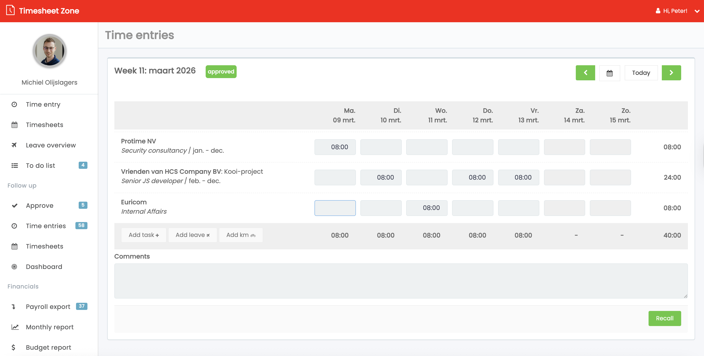

### Timesheets

**Prio 1:**

- The timesheets are per month
- You can navigate to the previous and next month or choose 'today'
- Each entered time entry (task or leave) is displayed in the month overview
- When a week-entry is approved, the color is highlighted (light green -> dark green)
- A summary of the days per task is provided 

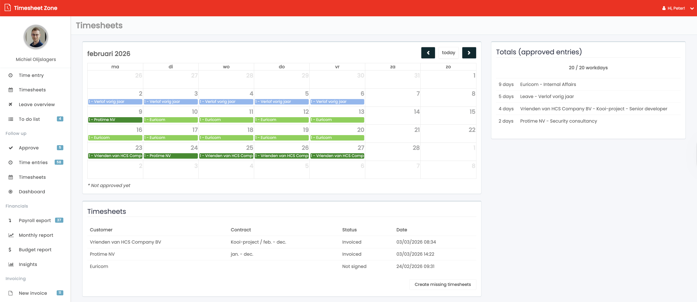

**Prio 2:**

- By clicking on a day-entry, the time entry page is opened for that week
- Timesheets per task (customer): month view

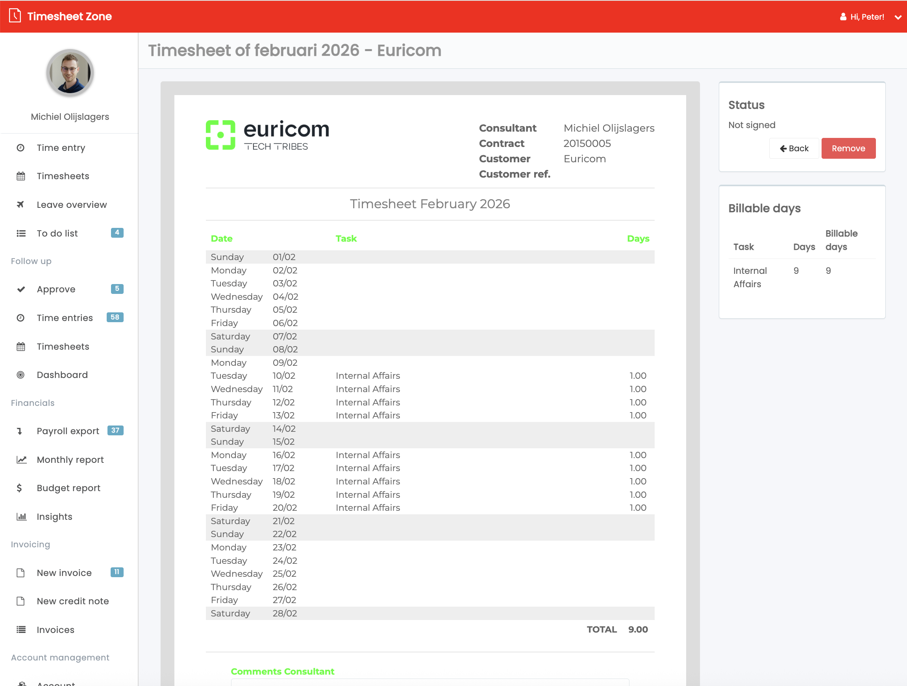

**Out of Scope:**

- Timesheet approval/signing

### Leave Overview

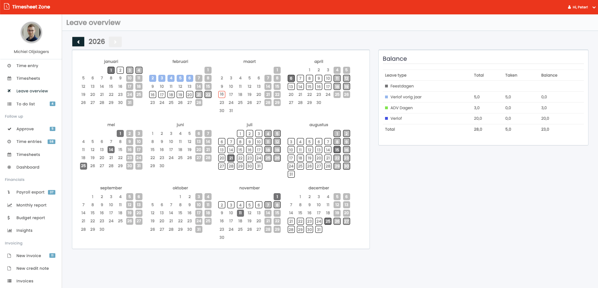

**Prio 1:**

- A year overview of all taken leave days (navigate to previous and next year)
- A summary (see balance) of total leave days for the user for the year
- Indication of the current date, weekend

**Prio 2**
- Indication of the school & work holidays (auto retrieved via https://www.openholidaysapi.org/en/)
- When clicking on a day, the time entry page is opened for that week

### Settings

All settings required for the time tracking and leave management.

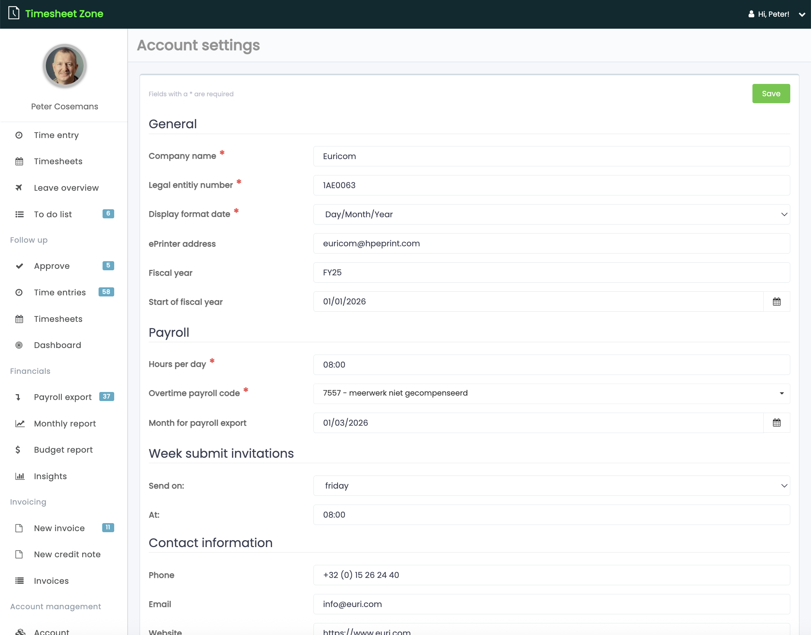

### Customers

A list of customers

Fields: 
- auto generated customer number
- customer name
- customer address (street, zip, city, country)
- contact person name & email

**Prio 2:**
- Client manager can be assigned to a customer

**Customer list**

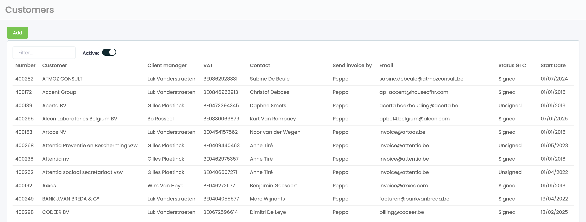

### Contracts

A list contract related to a customer

Fields: 
- auto generated contract number
- customer ref
- subject (typically project name, will be displayed in the time entry)
- consultant ref (based on the user list)
- task (name & rate, name is displayed in the time entry), eg: .NET Developer, €500/d
- start & end date (only contract in date range can be selected in time entry)

**Prio 2:**
- Client manager can be assigned to a contract

**Contract list**

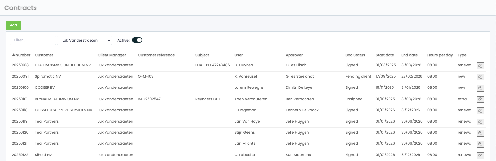

### Users

A list of a users

Fields: 
- Name
- Email
- Role (Admin, User, Client Manager)
- Total leaves per year (holidy, sick leave, ancientiteit, adv days)
- A leave can have following fields
  - Name
  - Allowed/NotAllowed/Limited (when limited, you can specify the total days, when not allowed)
  - Total days
  - Taken days
  - Balance days
  - Year
- When creating a new user, the total leaves per year is prefilled (leave: 20, adv: 5, ancientiteit: 0, sickness: 0)

**User list**

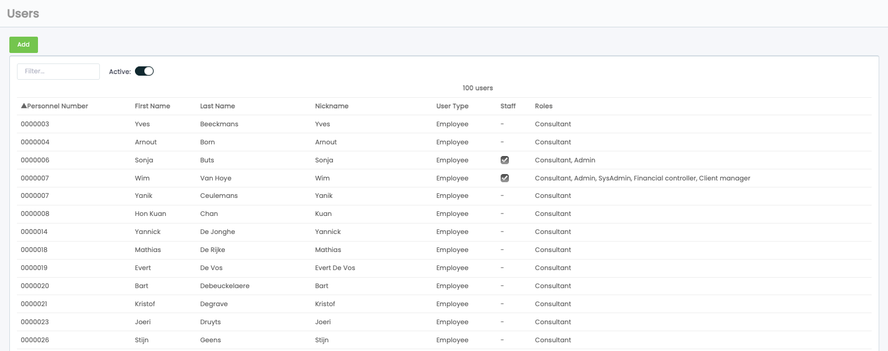

**User Settings**

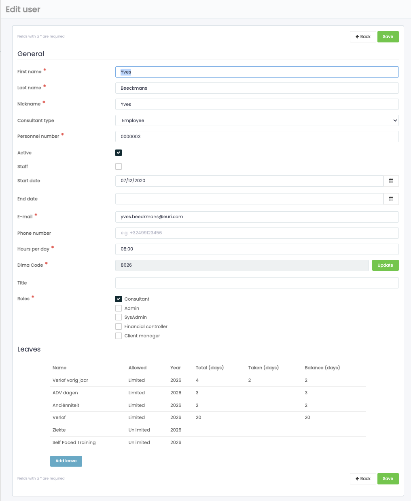

**Leave**

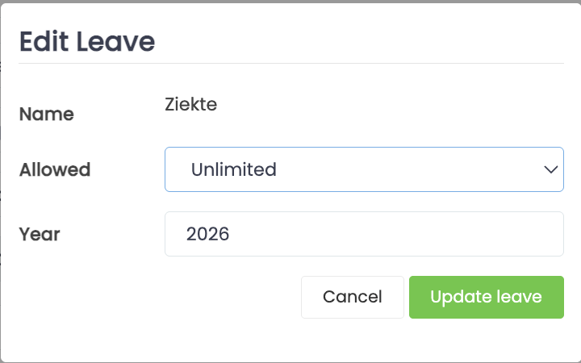

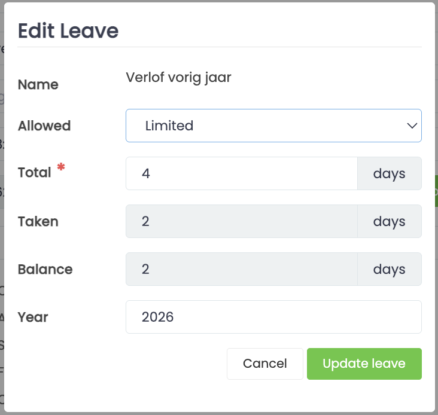

### Settings

**Leave Types**

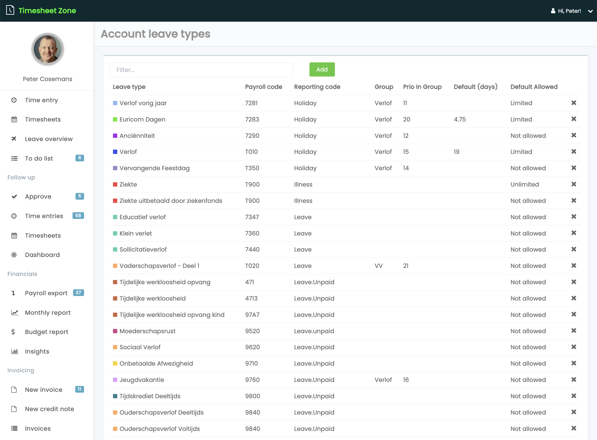